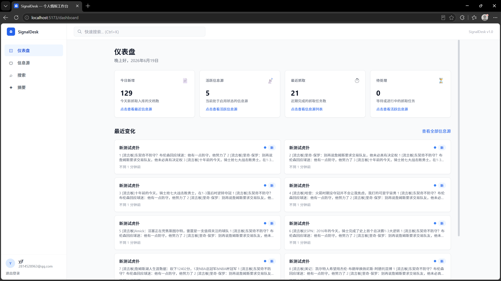
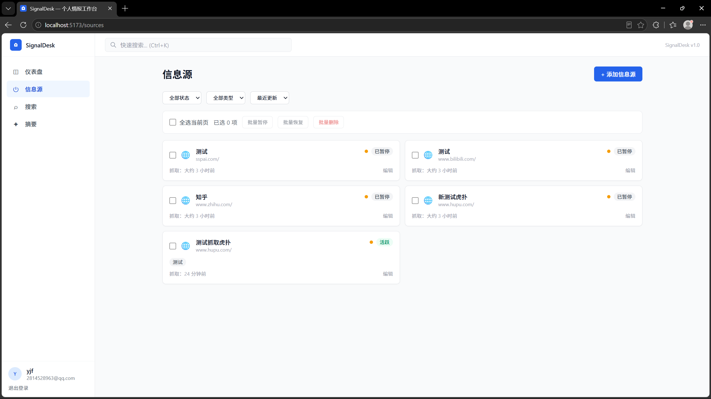
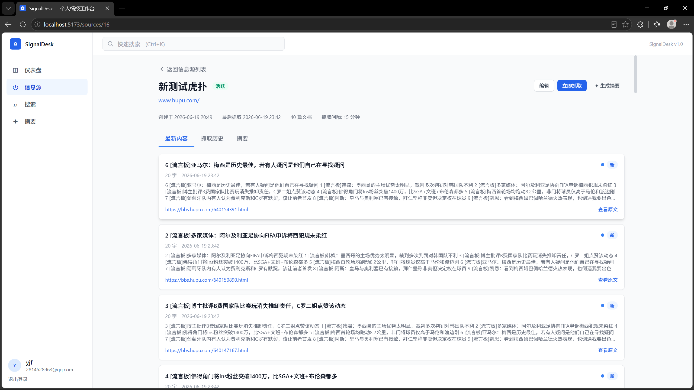
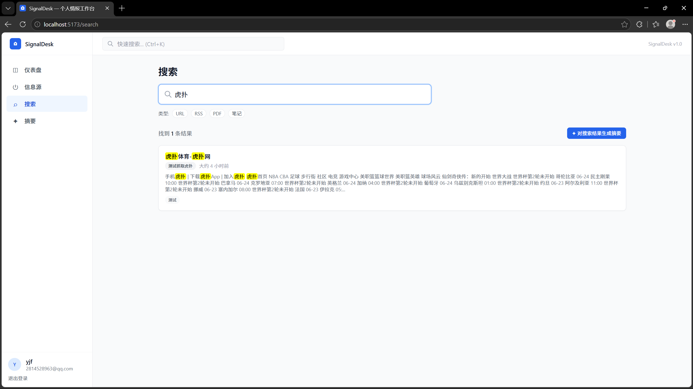

# SignalDesk

[English](./README.md) | [简体中文](./README.zh-CN.md)

> 一个面向个人研究与信息追踪的工作台，用来统一管理网站、RSS、PDF 和笔记，并提供搜索与 AI 摘要能力。

SignalDesk 面向独立研究者、分析型用户，以及希望建立个人信息工作流的开发者。你可以把分散在书签、RSS 阅读器、笔记工具里的信息源集中到一个工作台中，按计划抓取内容、归档历史文本、搜索旧资料，并基于已保存内容生成摘要。

## 为什么使用 SignalDesk

- 在一个产品中统一管理 URL、RSS、PDF 和笔记信息源
- 不只查看最新更新，还能保留可搜索的历史归档
- 在同一个仪表盘中查看抓取活动、变化记录和信息源状态
- 不离开工作台就能基于已抓取内容生成摘要
- 支持暂停、恢复、编辑、删除和批量管理信息源

## 典型使用流程

1. 添加想要追踪的信息源。
2. 手动抓取，或按计划自动抓取内容。
3. 查看归档内容和最近变化。
4. 通过关键词搜索历史资料。
5. 对搜索结果或已保存内容生成摘要。

## 界面截图

### 仪表盘



### 信息源列表



### 信息源详情



### 搜索 / 摘要



## 核心功能

### 信息源管理

- 创建和编辑监控中的信息源
- 支持 URL、RSS、PDF 和笔记类型
- 配置抓取频率和标签
- 暂停、恢复和删除信息源
- 在信息源列表中执行批量操作

### 内容监控

- 支持手动抓取和定时抓取
- 展示抓取历史和任务状态
- 保存解析后的内容并查看最新结果
- 跟踪信息源的内容变化
- 支持跳转到原始内容链接

### 搜索与摘要

- 按关键词搜索已抓取内容
- 按信息源类型筛选结果
- 快速查看搜索结果片段
- 基于搜索结果或信息源内容生成摘要

### 仪表盘

- 查看最近抓取到的文档
- 查看活跃信息源和最近抓取活动
- 快速跳转到重点内容和信息源页面

## 技术栈

### 后端

- Java 17
- Spring Boot 3
- Spring Security
- Spring Data JPA
- Flyway
- MySQL 8
- Redis
- Elasticsearch
- Jsoup
- JWT
- Maven

### 前端

- Vue 3
- Vite
- TypeScript
- Pinia
- Vue Router
- Tailwind CSS

## 架构

```text
用户
  -> Vue 3 前端
  -> Spring Boot 后端
     -> MySQL
     -> Redis
     -> Elasticsearch
     -> 外部内容源
```

## 项目结构

```text
.
|- backend/                        Spring Boot 后端
|- frontend/                       Vue 3 前端
|- docs/                           需求与设计文档
|- docker/                         容器相关文件
|- create_signaldesk_database.sql  数据库初始化脚本
|- README.md                       英文说明
`- README.zh-CN.md                 中文说明
```

## 快速开始

### 1. 准备依赖服务

请确保本地已具备以下服务：

- MySQL 8
- Redis
- Elasticsearch

默认配置文件：

- [backend/src/main/resources/application.yml](./backend/src/main/resources/application.yml)

### 2. 创建数据库

你可以手动执行以下 SQL：

```sql
CREATE DATABASE IF NOT EXISTS signaldesk
DEFAULT CHARACTER SET utf8mb4
COLLATE utf8mb4_unicode_ci;
```

也可以直接使用项目提供的脚本：

- [create_signaldesk_database.sql](./create_signaldesk_database.sql)

### 3. 启动后端

```bash
cd backend
mvn spring-boot:run
```

后端默认地址：

- `http://localhost:8080`

### 4. 启动前端

```bash
cd frontend
npm install
npm run dev
```

前端默认地址：

- `http://localhost:5173`

## 本地默认配置

- MySQL Host: `127.0.0.1`
- MySQL Port: `3307`
- Database: `signaldesk`
- Username: `root`

## 文档

项目文档位于：

- [docs/README.md](./docs/README.md)

包含内容：

- 需求分析
- 系统设计
- 数据库设计
- 前端设计
- 项目脚手架说明

## 适用场景

SignalDesk 适合以下场景：

- 跟踪指定网站是否有新内容
- 把 RSS 与手动维护的信息源放到同一个工作台
- 把 PDF、研究资料和笔记纳入统一的搜索归档
- 构建一个带搜索与摘要能力的个人研究资料库

## 路线图

- 优化复杂网站的正文提取效果
- 增强搜索与筛选能力
- 提升摘要质量和使用流程
- 完善信息源分组与标签管理
- 增加更丰富的仪表盘指标和抓取诊断
- 提供更轻量的一键本地启动方式

## 许可证

MIT
